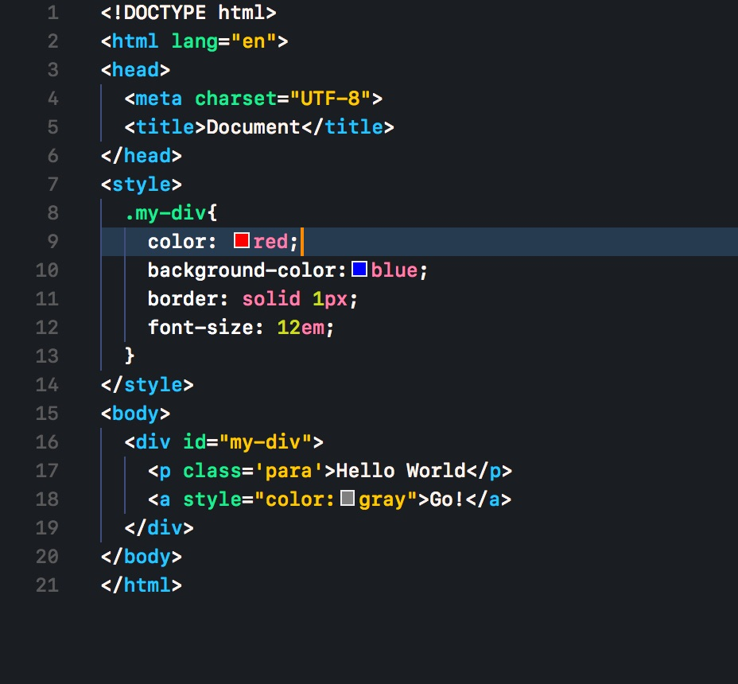
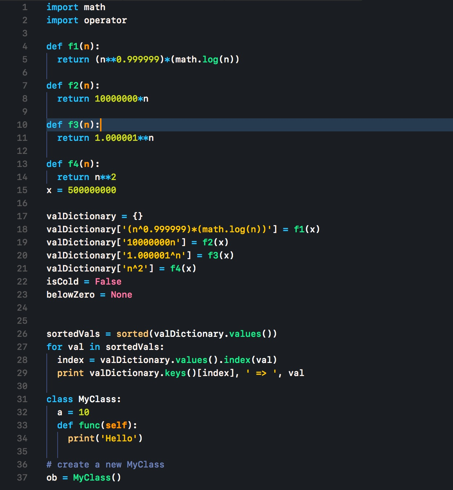
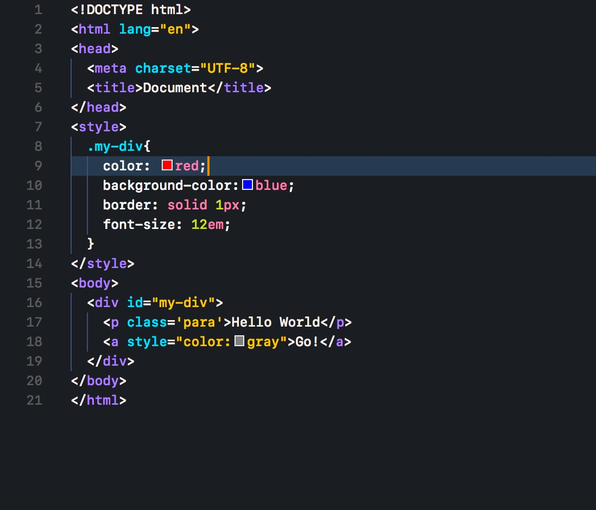
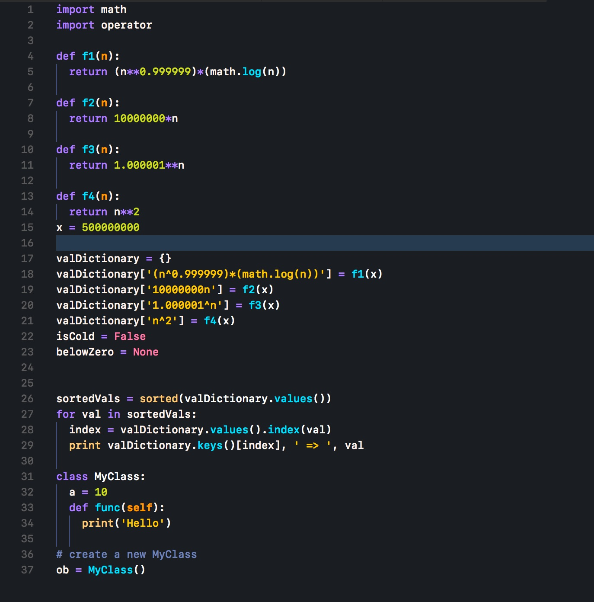
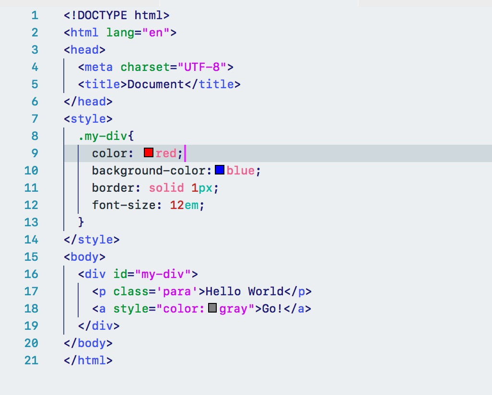
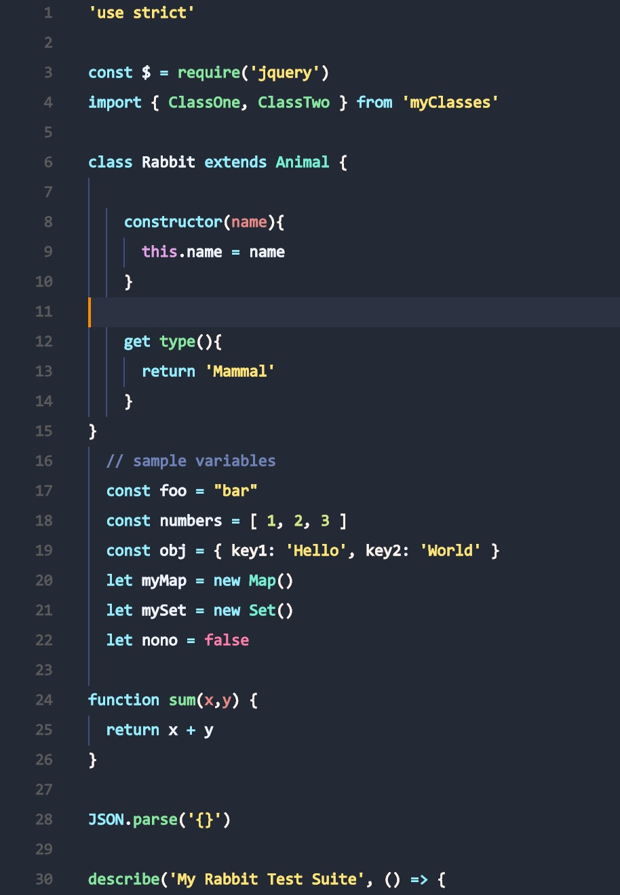
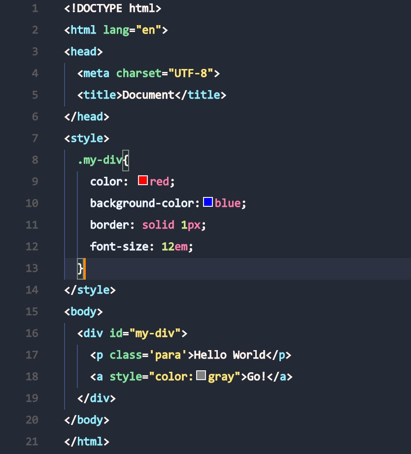
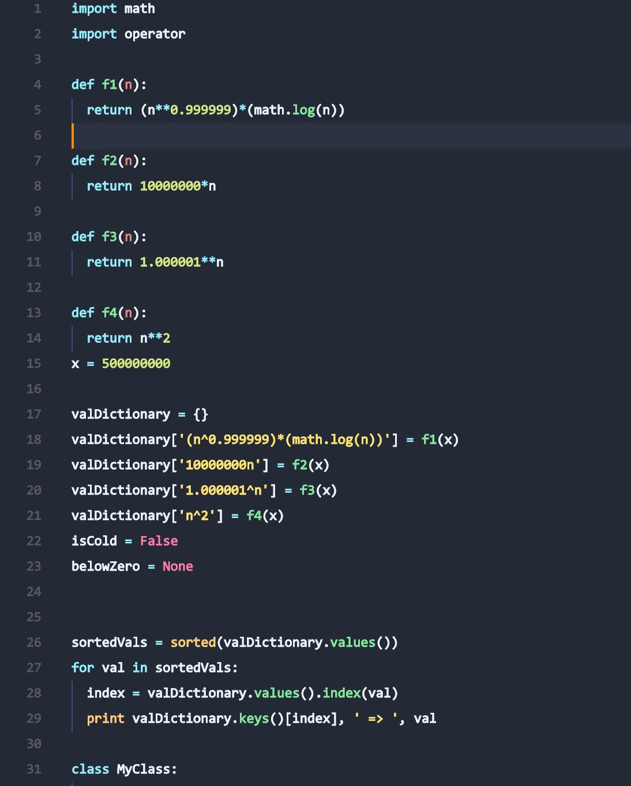
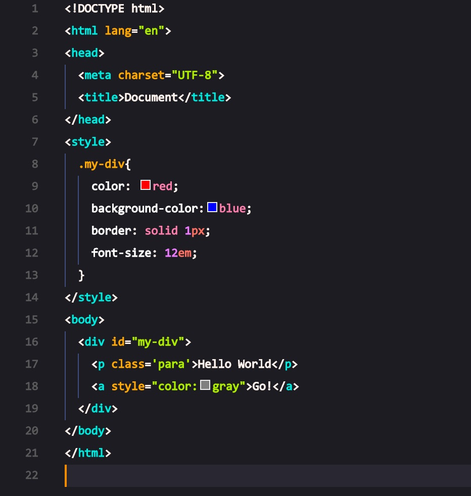
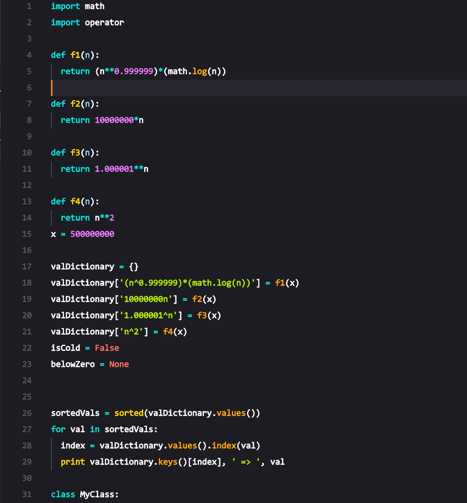

# JetJet Theme
This package comes with five themes: Original, Alternate, Light, Pastel and Prime.
These themes will work for VS Code versions 1.8.0 and greater.


# Workbench Customization

If you would like to cutomize the workbench colors to get a more complimentary look, you can add the `workbench.colorCustomizations` setting in your `settings.json`. Note that this works for version 1.12 and greater.
For example,
```json
"workbench.colorCustomizations":{
    "tab.activeBackground": "#012A4B",
    "activityBar.background": "#012A4B",
    "statusBar.background": "#012A4B",
    "activityBarBadge.background": "#FFD600",
    "activityBarBadge.foreground": "#1A1D21",
    "editorGroup.background": "#1A1D21",
    "sideBar.background": "#1A1D21"
}
```
Enjoy!
## Javascript (Original)

## HTML (Original)

## Python (Original)

## Javascript (Alternate)

## HTML (Alternate)

## Python (Alternate)

## Javascript (Light)

## HTML (Light)

## Python (Light)

## Javascript (Pastel)

## HTML (Pastel)

## Python (Pastel)

## Javascript (Prime)

## HTML (Prime)

## Python (Prime)

# License

Copyright 2017 Johny Georges

Permission is hereby granted, free of charge, to any person obtaining a copy of this software and associated documentation files (the "Software"), to deal in the Software without restriction, including without limitation the rights to use, copy, modify, merge, publish, distribute, sublicense, and/or sell copies of the Software, and to permit persons to whom the Software is furnished to do so, subject to the following conditions:

The above copyright notice and this permission notice shall be included in all copies or substantial portions of the Software.

THE SOFTWARE IS PROVIDED "AS IS", WITHOUT WARRANTY OF ANY KIND, EXPRESS OR IMPLIED, INCLUDING BUT NOT LIMITED TO THE WARRANTIES OF MERCHANTABILITY, FITNESS FOR A PARTICULAR PURPOSE AND NONINFRINGEMENT. IN NO EVENT SHALL THE AUTHORS OR COPYRIGHT HOLDERS BE LIABLE FOR ANY CLAIM, DAMAGES OR OTHER LIABILITY, WHETHER IN AN ACTION OF CONTRACT, TORT OR OTHERWISE, ARISING FROM, OUT OF OR IN CONNECTION WITH THE SOFTWARE OR THE USE OR OTHER DEALINGS IN THE SOFTWARE.